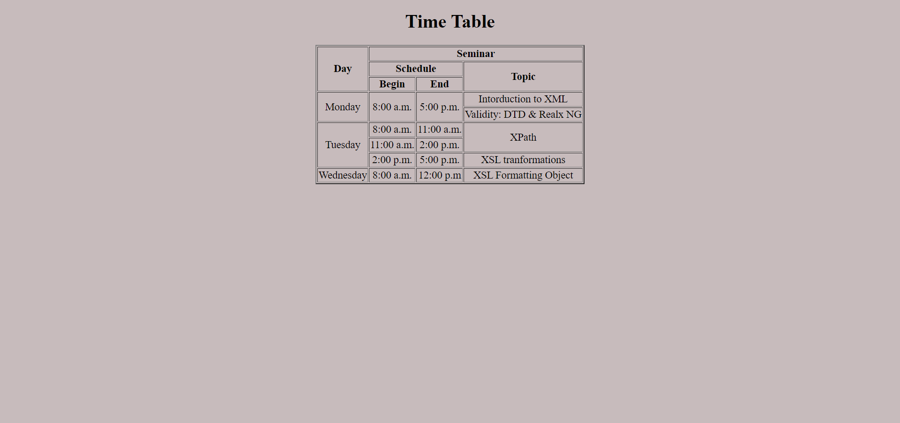

# Placement_Assignment2023_Ankita

## [Q.4_Resume](https://github.com/imankitadas/Placement_Assignment2023_Ankita/tree/main/01_HTML/Q.04_Resume)

🌐[LIVE LINK](https://6541f30b9b376d4b7b2adb29--incredible-salamander-ff8f06.netlify.app/) 

## [Q.5_Website](https://github.com/imankitadas/Placement_Assignment2023_Ankita/tree/main/01_HTML/Q.05_Website)

🌐[LIVE LINK](https://6541f5f13bff554c3f3aacb0--storied-snickerdoodle-b136b0.netlify.app/) 

### Output

## [Q.7_Music Player](https://github.com/imankitadas/Placement_Assignment2023_Ankita/tree/main/01_HTML/Q.07_MusicPlayer)

🌐[LIVE LINK](https://6541f685c292de46972b2fc5--vocal-fudge-cf69a5.netlify.app/) 

## [Q.10_TimeTable](https://github.com/imankitadas/Placement_Assignment2023_Ankita/tree/main/01_HTML/Q.10_TimeTable)

🌐[LIVE LINK](https://65433a0179d58817bb064df3--comfy-zabaione-cef53e.netlify.app/) 

### Output

